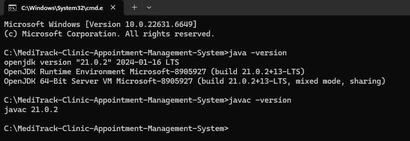

Setup_Instructions.md
MediTrack – Setup Instructions
This document explains how I set up my environment for the MediTrack (Clinic & Appointment Management System) project. 
It covers installing Java, configuring the IDE, creating the project structure, preparing the data folder, running the 
application, enabling CSV loading, and generating JavaDoc.

1. Install Java (JDK 17 or above)
   For this project, I used Java 21.
   Steps I followed:

Downloaded the JDK installer from the official website. Installed it using the default settings. Verified the 
installation in the terminal/command prompt:

java -version
javac -version

Both commands showed the installed Java version.

2. Configure JAVA_HOME (recommended)

Opened Environment Variables on Windows. Created a variable:
JAVA_HOME = C:\Program Files\Java\jdk-21.0.2

Added this to PATH:
%JAVA_HOME%\bin

Verified using:
echo %JAVA_HOME%

3. Install IntelliJ IDEA Community Edition

Downloaded IntelliJ IDEA Community Edition from JetBrains. Installed it using the default options. Opened IntelliJ and 
created a new Java Project. Selected Project SDK: Java 21.

4. Import the MediTrack Project from GitHub:
   git clone https://github.com/aarpit749/MediTrack-Clinic-Appointment-Management-System.git

Then opened the folder in IntelliJ. Inside IntelliJ, I confirmed the folder structure looked like:
src/main/java/com/airtribe/meditrack/
docs/
data/

5. Create the Required Package Structure
   Under src/main/java/com/airtribe/meditrack/, I created the following packages:
   constants/
   entity/
   exception/
   interfaces/
   service/
   util/
   test/

I then added all Java source files into their respective packages:

Entities (Person, Doctor, Patient, Appointment, Bill, BillSummary)
Services (DoctorService, PatientService, AppointmentService)
Utility classes (Validator, DateUtil, CSVUtil, IdGenerator...)
Exceptions
Interface files
Menu‑driven Main.java
TestRunner.java (manual testing)

6. Create the data/ Folder for CSV Persistence
   In the project root, I created:
   data/
   doctors.csv
   patients.csv
   appointments.csv

These CSVs act as the database for loading/saving data.

7. Running the Application
   Option A: Run from IntelliJ

Opened Main.java
Right‑clicked and selected Run 'Main'

To load data from CSV on startup:

Opened Run → Edit Configurations
Added this to Program arguments:

--loadData

8. Menu Options and Usage
   Once the program starts, the menu provides:

Add Patient
Add Doctor
List Patients
List Doctors
Search Patient
Create Appointment
List Appointments
Cancel Appointment
Generate Bill
Save CSV
Load CSV
Doctor Analytics (Streams)
Exit

I used these options to test CRUD operations, billing, search, appointments, and analytics.

9. Using TestRunner for Manual Testing
   I also verified the system by running:
   src/main/java/com/airtribe/meditrack/test/TestRunner.java

This runs:

CRUD operations
Deep copy
Billing
Streams analytics
Appointment handling
CSV saving

10. Generating JavaDoc (Bonus Feature)
    Using IntelliJ:

Tools → Generate JavaDoc
Set Output Directory to:

docs/javadoc

Click Generate
Open:

docs/javadoc/index.html

This generates a complete offline documentation website for the project.

11. Final Project Structure
    MediTrack/
    ├── src/
    │   └── main/java/com/airtribe/meditrack/
    │       ├── Main.java
    │       ├── entity/
    │       ├── service/
    │       ├── util/
    │       ├── exception/
    │       ├── interfaces/
    │       ├── constants/
    │       └── test/TestRunner.java
    ├── docs/
    │   ├── Setup_Instructions.md
    │   ├── JVM_Report.md
    │   ├── Design_Decisions.md
    │   └── javadoc/ (generated)
    ├── data/
    │   ├── doctors.csv
    │   ├── patients.csv
    │   └── appointments.csv
    └── README.md
